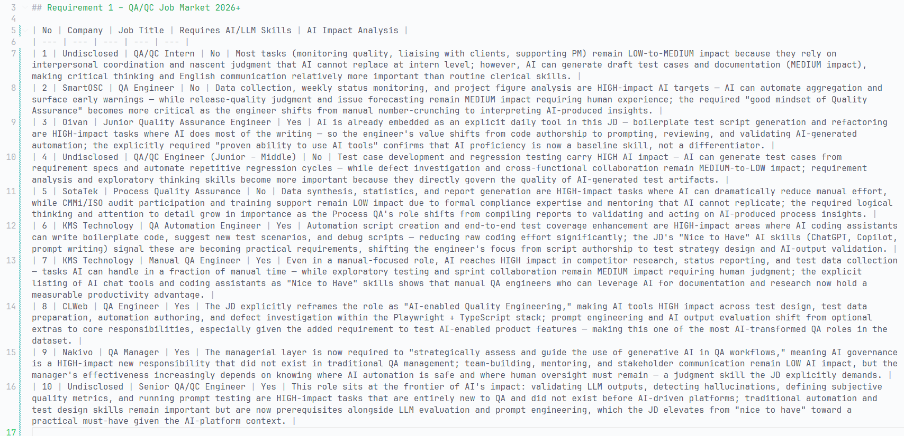

# Faculty of Information Technology (FIT) – Ho Chi Minh City University of Science (HCMUS)

## CS423 / CSC13003 – Software Testing (AI-augmented · 2026)

### AI POLICY · TEMPLATES — 2026 v1.0

# AI Audit Report — 5-section Template per Artifact

*Mandatory appendix for every AI-assisted homework (HW#01–HW#06, and Seminar).*

*Adapted from Med Kharbach, PhD (2026) — AI Use Policy Templates for Higher Education. CC BY-NC-SA 4.0. This adaptation is prepared for FIT@HCMUS – CS423 / CSC15003 Software Testing course.*

---

## 1. Student Information

| Field | Value |
|---|---|
| **Student name (printed):** | Nguyễn Bảo Duy |
| **Student ID:** | 23127179 |
| **Class / Cohort:** | 23KTPM02 |
| **Assignment ID (e.g., HW#00, HW#02):** | HW01 |
| **Assignment date:** | Monday, 12 May 2025, 12:00 AM |
| **AI tool(s) used:** | Claude |
| **AI tool(s) used:** | [X] Yes  [ ] No |

---

## 2. Instructions (read before filling)

- Add one row per AI-generated artifact (test case, script, checklist, OpenAPI spec, JMeter plan, etc.).
- Paste the verbatim prompt — DO NOT paraphrase.
- Paste the verbatim AI output (or include a labelled screenshot in the report).
- Tag the verdict: VALID / INVALID / INCOMPLETE.
- Reasoning must cite a course slide, ISTQB section, or technical RFC.
- Show the corrected artifact with the change highlighted.
- Sample rows are in italic — replace them before submission.

---

## 3. Audit Table — one row per artifact

### Artifact 1

1. Prompt: 
```
Role: Senior QA/QC Engineer. 
Context: I collected the 10 QA/QC JDs from many recruitment websites. I also export each Job Description to job_description.md in each sub-folder in @"03_requirements/Requirement 1 – QA QC Job Market 2026+\" . 
Task: Please read the JDs and fill in the "AI Impact Analysis" columns corresponding to each JD for me. Your reasoning process must follow these steps: 
1. Please read the "Job Description" Section and "Required Skills" in each JD (because JDs have both Vietnamese Description and English Description, you will think which section name will match with these part). 
2. With the Job Description, there will be a list of tasks that the employee will work with => You need to rank the AI Impact level (HIGH, MEDIUM, LOW) to each task based on the level that AI will help the employee finish this task => Analyse how AI will help them finish. 
3. Read the required skills and identify which requirements are becoming more important, less important, or different because of AI. 
=> Generate 1 - 2 sentences into "AI Impact Analysis" columns that show how AI impacts corresponding to each JD. 
Constraint: You mustn't self-reason based on the data that didn't exist in job_description.md.
```

2. Tool: CLAUDE
3. AI Output:



4. Verdict:

VALID

5. Reasoning:

According to ISTQB FL §3.1 and §3.2, a static testing (review) was performed on the AI output. The artifact is marked as VALID because the AI successfully satisfied all instructions, evaluation criteria, and constraints specified in the prompt without introducing any anomalies or external data deviations.

6. Student Fix: None    

### Artifact 2

1. Prompt: 
2. Tool:
3. AI Output:
4. Verdict:
5. Reasoning:
6. Student Fix:

---

## 4. Summary of AI Accuracy

Aggregate the verdicts from Section 3 and complete the table below.

| Metric | Count | Percentage |
|---|---|---|
| **Total AI-generated artifacts audited** | | |
| **VALID (correct, accepted as-is)** | | % |
| **INVALID (wrong; rejected)** | | % |
| **INCOMPLETE (acceptable after edits)** | | % |

---

## 5. Conclusion — When should AI be used (or not)?

Write 80–150 words describing patterns you observed. Where did AI shine? Where did AI fail? What is your recommendation for using AI in this kind of work in the future?

*(Write your conclusion here.)*

---

## 6. Mandatory Disclosure (paste verbatim)

> "[Test cases / script / dataset / report] was initially generated by [AI tool name]; I reviewed and modified [section X], added [edge cases Y, Z]; [section W] was written entirely by me. The detailed AI Audit Report is attached as Appendix A. I confirm I did not use AI to generate any artifact listed in the prohibited category."

### Signature

| Field | Value |
|---|---|
| **Student name (printed):** | |
| **Student ID:** | |
| **Class / Cohort:** | |
| **Course:** | CS423 / CSC13003 – Software Testing |
| **Instructor:** | |
| **Date:** | |
| **Signature:** | |

---

## References

- Kharbach, M. (2026). *AI Use Policy Templates for Higher Education.* CC BY-NC-SA 4.0.
- ISTQB Foundation Level Syllabus (latest version).
- Hardman, P. (2025). *A Post-AI Learning Taxonomy.*
- Fuster Rabella, M. (2025). OECD Education Working Paper No. 338.
- Perkins, M., Roe, J., & Furze, L. (2025). *AI Assessment Scale.*
- Anthropic (2025). *Building reliable AI test agents* — engineering blog.
- DeepEval & Promptfoo documentation — testing frameworks for LLM systems.
